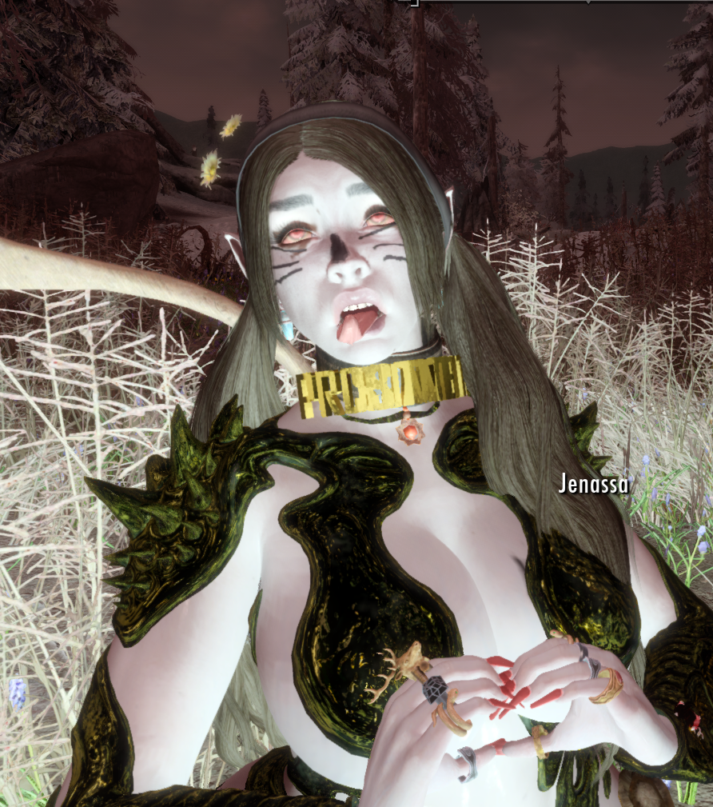

# Ahegao Dialog

A Skyrim mod that makes NPCs do Ahegao face during dialog.

Because this uses [CommonLibSSE NG](https://github.com/CharmedBaryon/CommonLibSSE-NG), it supports Skyrim SE, AE, GOG, and VR. 

Credit to [CommonLibSSE NG Template Plugin](https://github.com/Monitor221hz/CommonLibSSE-NG-Template-Plugin)
